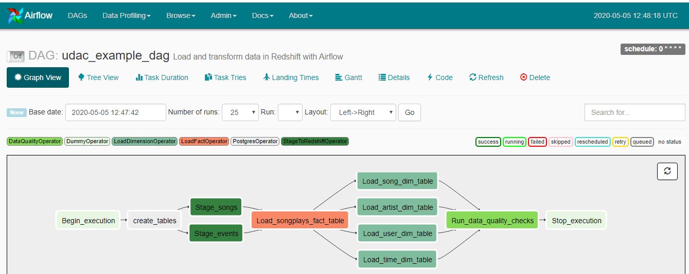

# Data Pipelines in Airflow

### Introducion
A music streaming company, Sparkify, has decided that it is time to introduce more automation and monitoring to their data warehouse ETL pipelines and come 
to the conclusion that the best tool to achieve this is Apache Airflow.  
In this project, we create high grade data pipelines that are dynamic and built from reusable tasks, can be monitored, and allow easy backfills. 
They have also noted that the data quality plays a big part when analyses are executed on top the data warehouse and want to run tests against 
their datasets after the ETL steps have been executed to catch any discrepancies in the datasets.  
The source data resides in S3 and needs to be processed in Sparkify's data warehouse in Amazon Redshift. The source datasets consist of JSON logs that tell 
about user activity in the application and JSON metadata about the songs the users listen to.  

### Project Description
We create custom operators to perform tasks such as staging the data, filling the data warehouse, and running checks on the data as the final step using Python and SQL.  

### Datasets
For this project, we'll be working with two datasets. Here are the s3 links for each:  

> Log data: s3://udacity-dend/log_data  
> Song data: s3://udacity-dend/song_data  

#### Song Dataset
The first dataset is a subset of real data from the [Million Song Dataset](https://labrosa.ee.columbia.edu/millionsong/). Each file is in JSON format and contains metadata about a song and the artist of that song. The files are partitioned by the first three letters of each song's track ID. For example, here are filepaths to two files in this dataset.  
> song_data/A/B/C/TRABCEI128F424C983.json
> song_data/A/A/B/TRAABJL12903CDCF1A.json

And below is an example of what a single song file, TRAABJL12903CDCF1A.json, looks like.  
    {"num_songs": 1, "artist_id": "ARJIE2Y1187B994AB7", "artist_latitude": null, "artist_longitude": null, "artist_location": "", "artist_name": "Line Renaud", "song_id": "SOUPIRU12A6D4FA1E1", "title": "Der Kleine Dompfaff", "duration": 152.92036, "year": 0}  

#### Log Dataset
The second dataset consists of log files in JSON format generated by this [event simulator](https://github.com/Interana/eventsim) based on the songs in the dataset above. These simulate activity logs from a music streaming app based on specified configurations.  
The log files in the dataset you'll be working with are partitioned by year and month. For example, here are filepaths to two files in this dataset.  
> log_data/2018/11/2018-11-12-events.json  
> log_data/2018/11/2018-11-13-events.json  

And below is an example of what the data in a log file, 2018-11-12-events.json, looks like.  

  

#### Schema for Song Play Analysis
Using the song and log datasets, you'll need to create a star schema optimized for queries on song play analysis. This includes the following tables.  
##### Fact Table
1.**songplays** - records in log data associated with song plays i.e. records with page ***NextSong***  
- songplay_id, start_time, user_id, level, song_id, artist_id, session_id, location, user_agent  

##### Dimension Tables
2.**users** - users in the app
- user_id, first_name, last_name, gender, level

3.**songs** - songs in music database  
- song_id, title, artist_id, year, duration  

4.**artists** - artists in music database  
-  artist_id, name, location, latitude, longitude  

5.**time** - timestamps of records in songplays broken down into specific units  
- start_time, hour, day, week, month, year, weekday  

#### Project Template
The project template package contains three major components for the project:

> 1.The dag template has all the imports and task templates in place, but the task dependencies have not been set  
> 2.The operators folder with operator templates  
> 3.A helper class for the SQL transformations  

##### Configuring the DAG
In the DAG, add **default parameters** according to these guidelines  

> 1.The DAG does not have dependencies on past runs  
> 2.On failure, the task are retried 3 times  
> 3.Retries happen every 5 minutes  
> 4.Catchup is turned off  
> 5.Do not email on retry  

##### Building the operators
To complete the project, you need to build four different operators that will stage the data, transform the data, and run checks on data quality.  
You can reuse the code from Project 2, but remember to utilize Airflow's built-in functionalities as connections and hooks as much as possible and 
let Airflow do all the heavy-lifting when it is possible.  
All of the operators and task instances will run SQL statements against the Redshift database. However, using parameters wisely will allow you to 
build flexible, reusable, and configurable operators you can later apply to many kinds of data pipelines with Redshift and with other databases.  

###### Stage Operator
The stage operator is expected to be able to load any JSON formatted files from S3 to Amazon Redshift. The operator creates and runs a SQL COPY 
statement based on the parameters provided. The operator's parameters should specify where in S3 the file is loaded and what is the target table.  
The parameters should be used to distinguish between JSON file. Another important requirement of the stage operator is containing a templated field 
that allows it to load timestamped files from S3 based on the execution time and run backfills.  

###### Fact and Dimension Operators
With dimension and fact operators, you can utilize the provided SQL helper class to run data transformations. Most of the logic is within the SQL 
transformations and the operator is expected to take as input a SQL statement and target database on which to run the query against. You can also 
define a target table that will contain the results of the transformation.  
Dimension loads are often done with the truncate-insert pattern where the target table is emptied before the load. Thus, you could also have a parameter 
that allows switching between insert modes when loading dimensions. Fact tables are usually so massive that they should only allow append type functionality.  

###### Data Quality Operator
The final operator to create is the data quality operator, which is used to run checks on the data itself. The operator's main functionality is to receive 
one or more SQL based test cases along with the expected results and execute the tests. For each the test, the test result and expected result needs to be 
checked and if there is no match, the operator should raise an exception and the task should retry and fail eventually.  
For example one test could be a SQL statement that checks if certain column contains NULL values by counting all the rows that have NULL in the column. 
We do not want to have any NULLs so expected result would be 0 and the test would compare the SQL statement's outcome to the expected result.  

###### Note about Workspace
After you have updated the DAG, you will need to run **/opt/airflow/start.sh** command to start the Airflow web server. Once the Airflow web server is ready, 
you can access the Airflow UI by clicking on the blue Access Airflow button.  

#### Add Airflow Connections
Here, we'll use Airflow's UI to configure your AWS credentials and connection to Redshift.  
> 1.To go to the Airflow UI:  
	> You can use the Project Workspace here and click on the blue Access Airflow button in the bottom right.  
	> If you'd prefer to run Airflow locally, open http://localhost:8080 in Google Chrome (other browsers occasionally have issues rendering the Airflow UI).  
> 2.Click on the Admin tab and select Connections.  
> 3.Under Connections, select Create.  
> 4.On the create connection page, enter the following values:
	> Conn Id: Enter aws_credentials.  
	> Conn Type: Enter Amazon Web Services.  
	> Login: Enter your Access key ID from the IAM User credentials you downloaded earlier.  
	> Password: Enter your Secret access key from the IAM User credentials you downloaded earlier.  
Once you've entered these values, select Save and Add Another.  

On the next create connection page, enter the following values:  

> Conn Id: Enter redshift.  
> Conn Type: Enter Postgres.  
> Host: Enter the endpoint of your Redshift cluster, excluding the port at the end. You can find this by selecting your cluster in the Clusters page of 
  the Amazon Redshift console. See where this is located in the screenshot below. IMPORTANT: Make sure to NOT include the port at the end of the Redshift 
  endpoint string.  
> Schema: Enter dev. This is the Redshift database you want to connect to.  
> Login: Enter awsuser.  
> Password: Enter the password you created when launching your Redshift cluster.  
> Port: Enter 5439.  
Once you've entered these values, select Save.  

Awesome! You're now all configured to run Airflow with Redshift.  

**WARNING: Remember to DELETE your cluster each time you are finished working to avoid large, unexpected costs.**  

Below is the songs ERD.  

  

Following is the DAG.  

  